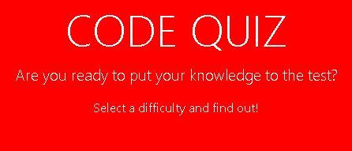

# code_quiz

## Project Title

This is the 4th Homework Assignment for the Columbia Coding Bootcamp. It is a Code Quiz. Prepare to be challenged!

## Project Link

https://jamesrowe1.github.io/code_quiz/

## Screenshot

## Getting Started

Begin by selecting a difficulty. The higher the difficulty, the more questions you must answer in the same amount of time.

## Prerequisites

You must have a working web browser. Knowledge of coding and coding terms is suggested. Sound is included on both right and wrong answers, as well as background music at approximately 30 seconds remaining, so working speakers are neccessary to hear that.

## Built With

- Visual Studio Code
- HTML
- CSS
- JavaScript
- Chrome
- Hosted by Github
- https://www.myinstants.com/ (provided the sound clips)

## Authors

James Rowe

## License

Licensed under Awesome Coding L.L.C. (not a real company)

## Troubleshooting

For any issues contact James Rowe

## Acknowledgments

- Ben Wright
- Justin Simero
- Wilson Linares
- And my study group:
- Justin Ramirez
- Michael Haber
- Gabriel Hernandez
- Tiffany Lombardi
- Melissa Mercado
